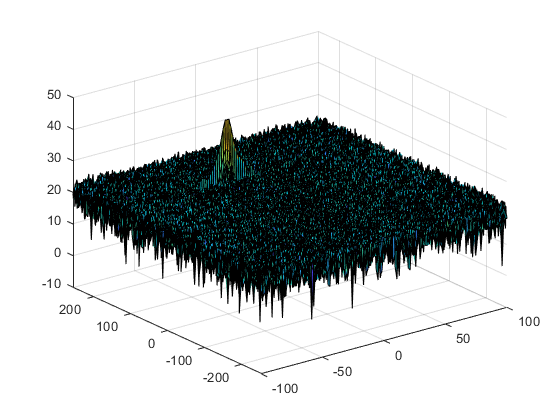
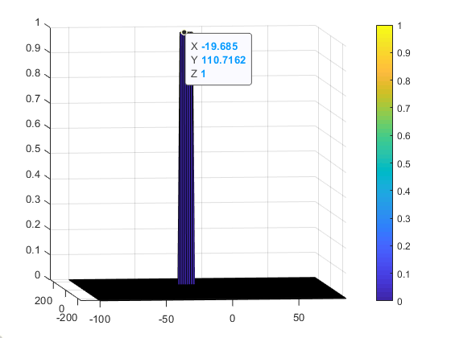

# Radar Target Generation and Detection

#Range FFT

 #plot the output of 2DFFT
 
 
## Implementation Steps
The 2D CFAR is similar to 1D CFAR, but is implemented in both dimensions of the range doppler block. The 2D CA-CFAR implementation involves the training cells occupying the cells surrounding the cell under test with a guard grid in between to prevent the impact of a target signal on the noise estimate.

##Selection of Training, Guard cells and offset
1. Determine the number of Training cells for each dimension Tr and Td. Similarly, pick the number of guard cells Gr and Gd.

2. Slide the Cell Under Test (CUT) across the complete cell matrix

3. Select the Grid Size = (2Tr+2Gr+1)(2Td+2Gd+1).

4. The total number guard region and cell under test is:  (2Gr+1)(2Gd+1).

5. The number of training Cells is: (2Tr+2Gr+1)(2Td+2Gd+1) - (2Gr+1)(2Gd+1)

6.  Measure and average the noise across all the training cells to obtain the threshold.

7.  Add the offset (if in signal strength in dB) to the threshold to keep the false alarm to the minimum.

##Steps taken to suppress the non-thresholded cells at the edges.
1.  Determine the signal level at the Cell Under Test. If the CUT signal level is greater than the Threshold, assign a value of 1, else equate it to zero. Since the cell under test are not located at the edges, due to the training cells occupying the edges, we suppress the edges to zero. Any cell value that is neither 1 nor a 0, assign it a zero.

